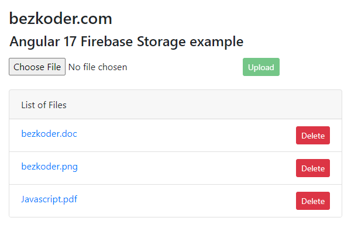

# Angular 17 File Upload to Firebase Storage example

I will show you how to make Angular 17 Firebase Storage: File Upload/Display/Delete Application using `@angular/fire` & `AngularFireStorage`. Files' info will be stored in Firebase Realtime Database.

For more detail, please visit:
> [Angular 17 Firebase Storage: File Upload/Display/Delete example](https://www.bezkoder.com/angular-17-firebase-storage/)

## More Practice
> [Angular 17 Firestore CRUD example](https://www.bezkoder.com/angular-17-firestore-crud/)

> [Angular 17 Firebase CRUD example with Realtime DataBase](https://www.bezkoder.com/angular-17-firebase-crud/)

> [Angular 17 example: CRUD with Rest API](https://www.bezkoder.com/angular-17-crud-example/)

> [Angular 17 Form Validation example](https://www.bezkoder.com/angular-17-form-validation/)

> [Angular 17 JWT Authentication & Authorization with Rest API](https://www.bezkoder.com/angular-17-jwt-auth/)

Fullstack with Node:
> [Angular 17 + Node Express + MySQL example](https://www.bezkoder.com/angular-17-node-js-express-mysql/)

> [Angular 17 + Node Express + PostgreSQL example](https://www.bezkoder.com/angular-17-node-js-express-postgresql/)

> [Angular 17 + Node Express + MongoDB example](https://www.bezkoder.com/angular-17-node-js-express-mongodb/)

> [Angular 17 + Node Express: File upload example](https://www.bezkoder.com/angular-17-node-express-file-upload/)

Fullstack with Spring Boot:

> [Angular 17 + Spring Boot example](https://www.bezkoder.com/spring-boot-angular-17-crud/)

> [Angular 17 + Spring Boot + MySQL example](https://www.bezkoder.com/spring-boot-angular-17-mysql/)

> [Angular 17 + Spring Boot + PostgreSQL example](https://www.bezkoder.com/spring-boot-angular-17-postgresql/)

> [Angular 17 + Spring Boot + MongoDB example](https://www.bezkoder.com/spring-boot-angular-17-mongodb/)

> [Angular 17 + Spring Boot: File upload example](https://www.bezkoder.com/angular-17-spring-boot-file-upload/)

Fullstack with Django:
> [Angular + Django example](https://www.bezkoder.com/django-angular-13-crud-rest-framework/)

> [Angular + Django + MySQL](https://www.bezkoder.com/django-angular-mysql/)

> [Angular + Django + PostgreSQL](https://www.bezkoder.com/django-angular-postgresql/)

> [Angular + Django + MongoDB](https://www.bezkoder.com/django-angular-mongodb/)